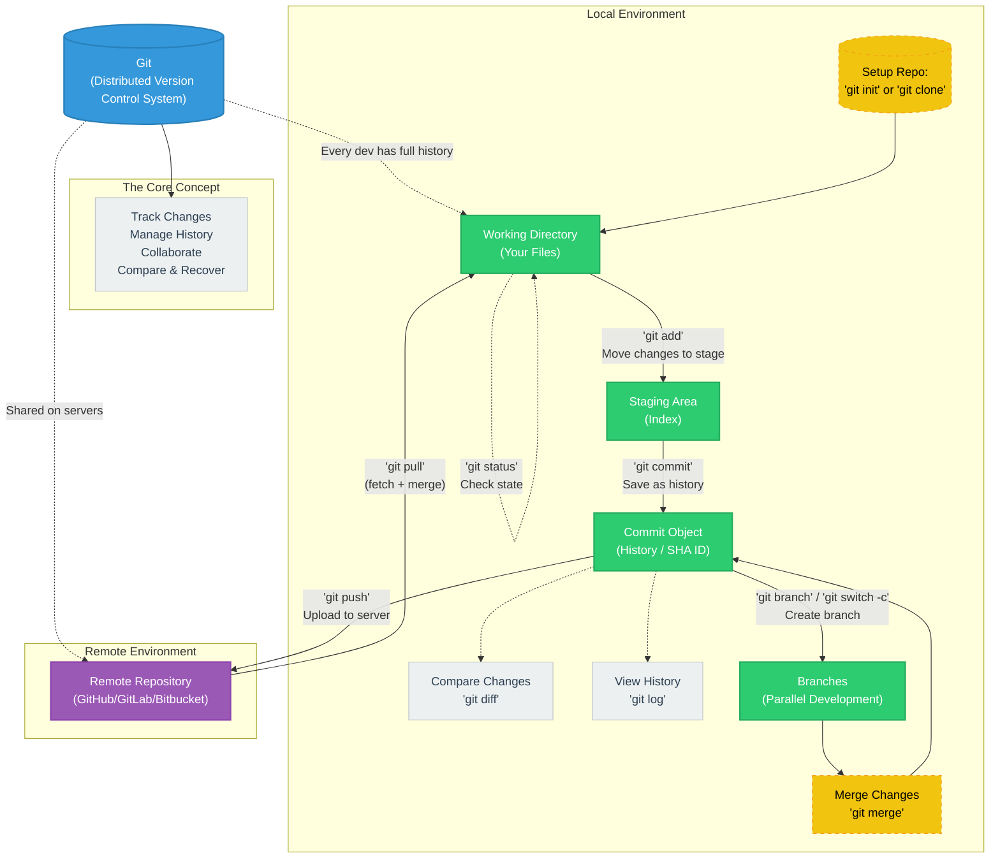

# Git Workflow: A Mental Model

## 🏗 Architecture & Mental Model Diagram

## 🎯 왜 이 멘탈 모델이 필요한가?

Git을 처음 접할 때 가장 큰 진입 장벽은 명령어가 아닙니다. 코드가 어디에 머물러 있는지, 각 명령어가 어떤 구역 간의 이동을 의미하는지 보이지 않기 때문입니다. 이 문서는 Git의 4가지 주요 공간(Working Directory, Staging Area, Local Repository, Remote Repository)을 중심으로 상태와 데이터 흐름을 시각화합니다.

## 🏗 아키텍처 개요

Git의 아키텍처는 크게 세 영역으로 나뉩니다.

1. **Local Workflow (작업 공간)**: 내가 코드를 짜고 확정하는 공간
2. **Branching (병렬 개발)**: 여러 작업을 동시에 안전하게 진행하는 논리적 분기
3. **Remote Collaboration (협업 공간)**: 완성된 작업물을 팀과 공유하고 동기화하는 공간

## 🔄 3단계 상태 흐름 (The Core Local Workflow)

코드는 항상 다음 3개의 구역을 거쳐 안전하게 기록됩니다.

1. **Working Directory (작업 디렉토리)**
   - 내가 현재 파일을 수정하고 있는 물리적 공간입니다.
   - 아직 Git이 공식적으로 추적하거나 확정하지 않은 상태입니다.
2. **Staging Area / Index (스테이징 영역)**
   - `git add` 명령어를 통해 "이 파일들을 다음 번에 저장할 거야"라고 찜해두는 임시 대기열입니다.
   - 의미 있는 단위로 변경 사항을 묶을 때 필수적인 공간입니다.
3. **Local Repository / History (로컬 저장소)**
   - `git commit` 명령어를 통해 Staging Area에 있던 파일들이 하나의 사진(Snapshot)처럼 확정되어 역사에 기록됩니다.
   - 각 커밋은 고유한 SHA 해시값을 가지며, 원할 때 언제든 이 상태로 돌아올 수 있습니다.

## 🔀 병렬 개발과 통합 (Branch & Merge)

- **Branch**: 기본 줄기(`main` 등)에서 뻗어 나와, 기존 코드에 영향을 주지 않고 새로운 기능이나 버그 수정을 진행하는 독립된 공간입니다.
- **Merge**: 브랜치에서의 작업이 끝나면, 다시 원래의 줄기로 작업 내용을 안전하게 합칩니다.

## ☁️ 원격 동기화 (Remote Collaboration)

- 로컬 컴퓨터의 한계를 벗어나, GitHub, GitLab 등의 서버(Remote Repository)에 내 기록을 올리고(`push`) 다른 사람의 기록을 내려받는(`pull`) 과정입니다.

---

*이 가이드는 '기전(Mechanism)에 대한 깊은 이해'를 돕기 위해 작성되었습니다.*