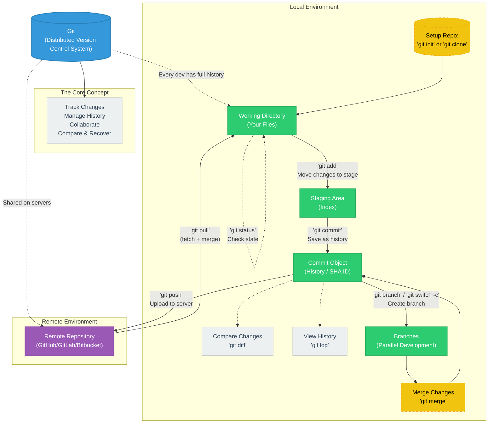

```mermaid
graph TD
    %% Styling
    classDef gitCore fill:#3498db,stroke:#2980b9,stroke-width:2px,color:white;
    classDef localRepo fill:#2ecc71,stroke:#27ae60,stroke-width:2px,color:white;
    classDef remoteRepo fill:#9b59b6,stroke:#8e44ad,stroke-width:2px,color:white;
    classDef action fill:#f1c40f,stroke:#f39c12,stroke-width:1px,color:black,stroke-dasharray: 5 5;
    classDef note fill:#ecf0f1,stroke:#bdc3c7,stroke-width:1px,color:#2c3e50;

    %% Nodes
    Git[("Git\n(Distributed Version Control System)")]:::gitCore
    
    subgraph "The Core Concept"
        Functions["Track Changes\nManage History\nCollaborate\nCompare & Recover"]:::note
    end

    subgraph "Local Environment"
        InitClone[("Setup Repo:\n'git init' or 'git clone'")]:::action
        WorkDir["Working Directory\n(Your Files)"]:::localRepo
        Stage["Staging Area\n(Index)"]:::localRepo
        CommitObj["Commit Object\n(History / SHA ID)"]:::localRepo
        
        Compare["Compare Changes\n'git diff'"]:::note
        History["View History\n'git log'"]:::note
        
        Branching["Branches\n(Parallel Development)"]:::localRepo
        Merge["Merge Changes\n'git merge'"]:::action
    end

    subgraph "Remote Environment"
        Remote["Remote Repository\n(GitHub/GitLab/Bitbucket)"]:::remoteRepo
    end

    %% Connections
    Git --> Functions
    Git -.-> |"Every dev has full history"| WorkDir
    Git -.-> |"Shared on servers"| Remote
    
    InitClone --> WorkDir
    
    WorkDir --> |"'git add'\nMove changes to stage"| Stage
    WorkDir -.-> |"'git status'\nCheck state"| WorkDir
    
    Stage --> |"'git commit'\nSave as history"| CommitObj
    
    CommitObj -.-> Compare
    CommitObj -.-> History
    
    CommitObj --> |"'git push'\nUpload to server"| Remote
    Remote --> |"'git pull'\n(fetch + merge)"| WorkDir
    
    CommitObj --> |"'git branch' / 'git switch -c'\nCreate branch"| Branching
    Branching --> Merge
    Merge --> CommitObj
```